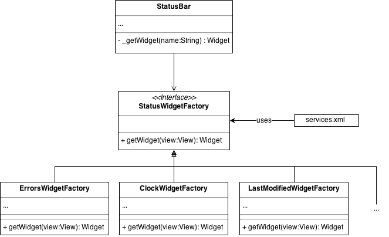
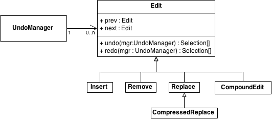

% Software Architectures - Assignement 1: Design patterns
% Abdeslam Bakkali Taheri; Vincent Lindivat

# Exercise 1: Find instances of Design Patterns

In this exercise, we had to find instances of design patterns in Jedit's code, Jedit being an open source text editor written in Java.

<!-- TODO describe the participants (class & method names) -->
<!-- TODO class diagram (only include the necessary elements)-->
<!-- TODO motivation & application of the pattern in this context (don't give a general description of the pattern) -->
<!-- TODO in what way these implementations differ from the original pattern -->

## Singleton
<!-- Related links :
    * http://www.oodesign.com/singleton-pattern.html
    * https://en.wikipedia.org/wiki/Singleton_pattern
    * https://stackoverflow.com/questions/137975/what-is-so-bad-about-singletons
    * http://tech.puredanger.com/2007/07/03/pattern-hate-singleton/
    * http://programminglarge.com/singleton-design-pattern-vs-global-variable/
    * http://gameprogrammingpatterns.com/singleton.html
    * https://programmers.stackexchange.com/questions/148108/why-is-global-state-so-evil
    * On dependency injection :
        * http://www.theserverside.com/news/1321158/A-beginners-guide-to-Dependency-Injection
        * http://www.drdobbs.com/tools/dependency-injection-testable-objects/185300375
        * http://tutorials.jenkov.com/dependency-injection/index.html
        * http://www.tonymarston.net/php-mysql/dependency-injection-is-evil.html
        * https://stackoverflow.com/questions/2407540/what-are-the-downsides-to-using-dependency-injection
        * http://www.warski.org/blog/2010/10/dependency-injection-discourages-object-oriented-programming/
-->

The singleton pattern is categorized as a creational pattern because it ensures that a specific class is **instantiated** only once.

It is often criticized because an instance of a class using this pattern can be used like a global variable. A global variable causes problem for unit testing, because it can be modified by everyone and causes unpredictability in the state of the system. It also introduces coupling with classes using it, which renders them hardly reusable. <!-- TODO ref -->

While using global variables may be seen as bad practice, and while there are alternatives (e.g. dependency injection), these alternatives may bring drawbacks such as having the code difficult to read, or the intent of the developpers may not be easy to grasp at first glance. Global variables may even be the simplest way of using tools such as a Logging class which is not directly part of the application but only here to help debugging. <!-- TODO ref -->

<!-- The gist of it is that design patterns should be used with parcimony, and should not be treated like some unquestionable magical spell. They are recipes, and can be adapted and modified to fit more specific problems that a developer encounters. Also, each decision has associated drawbacks, there is no such thing as perfect design. -->

The example we chose for a singleton implementation is the *PluginManager*[^1] class. This class handles the window (extends *JFrame*) where plugins are installed and updated. The singleton pattern is used in this case so that only one plugin manager window can be instantiated and displayed at once when invoking it via the menu (*Plugins -> Plugin Manager...*). The following methods are involved :

[^1]: *org.gjt.sp.jedit.pluginmgr* package

* the *showPluginManager()* method instantiate a PluginManager if it has not already been instantiated, else it brings the plugin manager window to the front;
* The *getInstance()* method retrieve the current instance of PluginManager (can be null if it has not yet been instantiated or if the instance has been disposed of with the *dispose()* method).

\

The following classes are also implementing a singleton pattern, but we won't describe them in details.

* *ReflectManager* (*org.gjt.sp.jedit.bsh*)
* *KillRing* (*org.gjt.sp.jedit.buffer*)
* *ModeProvider* (*org.gjt.sp.jedit.syntax*)
* *TransferHandler* (*org.gjt.sp.jedit.datatransfer*)
* *DockableWindowFactory* (*org.gjt.sp.jedit.gui*)

## Abstract Factory
The abstract factory pattern is a creationnal pattern which helps creating related objects.

The example found in jEdit's code is centered around the *StatusWidgetFactory* interface which must be implemented by all the factories related to constructing statusbar widgets. Examples of factories implementing it are *ErrorsWidgetFactory*, *ClockWidgetFactory*, *LastModifiedWidgetFactory*. It's purpose is to instantiate StatusBar widgets without having to specify the concrete class needed to construct it.

\

**N.B.** Statusbar widgets also seem to be used as services and are listed in the *services.xml* file. This file specifies the services' classes or factory classes, namees and ways of instantiating them (constructor to call). Each service is a singleton handled by the *ServiceManager*. By loading services through an XML file, the program handles the instantiation of services the same way for all services. Moreover, the program's code does not need to be modified to add a service, only the xml must be modified; hence, the *ServiceManager* does not need to depend on all the services' factories and the coupling is reduced.

## Observer
The Observer is a behavioral pattern, it is justified by the fact that subjects communicate with observers to which they are registered.

The example we chose for this pattern is composed of the *Autosave*[^2], *ActionListener*[^3] & *Timer*[^4] classes. The *Autosave* class' purpose is to automatically save all buffers with unsaved changes after a certain amount of time has elapsed (default value is 30 secondes). This class implements the *ActionListener* (awt) interface which contains the *actionPerformed()* method. This method is called by a subject, here the subject being a *Timer* (swing) which calls *actionPerformed()* after the specified amount of time has elapsed. Finally, *actionPerformed()* calls the *autosave()* method on all the buffers (the buffers are globally accessible from *jEdit*'s *getBuffer()* static method). The Observer pattern is a way of avoid busy-waiting, instead of checking repeatedly whether the time has elapsed, it lets the *Timer* notify that he has finished counting to its listeners (*Autosave*).

[^2]: *org.gjt.sp.jedit.Autosave*
[^3]: *java.awt.event.ActionListener*
[^4]: *javax.swing.Timer*

\

The following classes are also implementing an observer pattern but were not chosen as our example.

* *RegistersListener* as the observer interface, *JEditRegistersListener* as the concrete observer, and *Registers* as the subject
* *HelpHistoryModelListener* as the observer interface, *HelpViewer* as the concrete observer and *HelpHistoryModel* as the subhect (*org.gjt.sp.jedit.help*)

## Adapter
<!-- Related links:
    * http://www.oodesign.com/visitor-pattern.html
    * https://en.wikipedia.org/wiki/Visitor_pattern
    * http://sourcemaking.com/design_patterns/visitor
-->

The adapter pattern is a structural pattern used to pass an instance of a class having an interface to a client expecting another interface through a wrapper.

Here we have the *BufferAdapter*[^5] class which implements the *BufferListener*[^5] interface. This class contains all the *BufferListener*'s methods with empty bodies. Then, one class can inherit from *BufferAdapter* in order to avoid having to implement all *BufferListener*'s methods (e.g. *ElasticTabStopBufferListener*[^6], or the anonymous class in the *Gutter*[^6] class' constructor). As stated in *BufferListener*'s documentation, this interface may change in the future. By using *BufferAdapter* instead of *BufferListener* as the expected interface, developpers will only have to modify *BufferAdapter* if *BufferListener* is modified.

[^5]: *org.gjt.sp.jedit.buffer* package
[^6]: *org.gjt.sp.jedit.textarea* package

<!-- TODO this implementation corresponds to the Class Adapter described on the wikipedia page but differs from the one described in the *Head First Design Patterns* book -> find more information -->

\

Other Adapter patterns were found in jedit's code which have the same purpose as described above :

* *BufferSetAdapter* implementing *BufferSetListener* (*org.gjt.sp.jedit.bufferset*)
* *JEditVisitorAdapter* implementing *JEditVisitor* (*org.gjt.sp.jedit.visitors*)

## Visitor
The visitor design pattern is a behavioral pattern, its purpose being to separate algorithms from an object structure (e.g. composite).

In jEdit's case, the object structure is composed of the following classes: *View*, *EditPane* and *TextArea*[^6]. The visitor interface is called *JEditVisitor*[^7] and some concrete implementations are *SaveCaretInfoVisitor* and some anonymous classes. The purpose of this design pattern here is to have multiple operations available for an element without having to modify it. As of jEdit's 5.2 version :
* *View* is only visited to visit its *EditPanes* and the *EditPanes*' *TextAreas*
* *TextArea* does not seem to have any behaviour added through the visitors for the moment
* *EditPanes* as several behaviours added through *SaveCaretInfoVisitor* and other anonymous classes implementing *JEditVisitor* (e.g. in *BufferSetManager*, *CompleteWorld* and *Buffer*).

[^7]: *org.gjt.sp.jedit.visitors* package

\

As for the differences with the original pattern, the elements from the object structure being visited do not implement a common interface.

# Exercise 2: Recognize Design Patterns
First of all, please find below a simplified class diagram to visualize more easily how the different classes interact.

\

The inner classes *Edit*, *Insert*, *Remove*, *Replace*, *CompressedReplace*, *CompoundEdit* are part of an implementation of the Command design pattern which is a behavioral pattern. *Edit* is an abstract class that all commands inherits. Each command must implement an *undo()* and a *redo()* action. By using this pattern, each operation applied to a buffer (e.g. inserting text, removing text) is instantiated as a class implementing the *Edit* interface so that they can be easily saved in queues in order to *undo()* or *redo()* them. Without this pattern, undo and redo could be implemented by saving the content of the buffer after each operation, but that would be more expensive memory-wise.

The *Edit* abstract class and its children are part of a composite design pattern, which is a structural pattern. In this implementation, there are no leafs, only composite elments (*Edit* and its children). This pattern is used here in order to retrieve the previous and next *Edit*, which is useful for implementing the redo and undo queues.

# Exercise 3: Coupling & Cohesion

## Levels of coupling and cohesion
<!--
 Related links
    * https://stackoverflow.com/questions/39946/coupling-and-cohesion
    * https://stackoverflow.com/questions/3085285/cohesion-coupling
-->

**Cohesion** refers to how related attributes and methods are within a class and if they are responding to the class' intention. **High cohesion**, which is preferable, means that a class does one specific job well. Low cohesion, which should be avoided, means that the class is not focused on one thing and could be refactored. For example, an *User* class containing attributes such as the name or the email address and methods for sending messages to other users has a low cohesion, since message handling could be refactored and done by other classes.

**Coupling** refers to the dependencies between classes. Highly coupled classes cannot be used independently, consequently, changes to those classes are difficult to make without having to modify all the dependent classes. It's also hard to reuse and test classes with high coupling because all the dependencies must be carried with them. So, we should try to have **low coupling** between the modules in our programms.

## Cohesion in jEdit

### MiscUtilities
*MiscUtilities* has a coincidental type of cohesion, which corresponds to low cohesion. As the class' name implies, it contains miscellaneous tools: the developpers did not know where to put them, so they put them all in one big class with no relation between the members. Some possible improvements below.

* A first simple step to improve the situation would be to group together all related methods (e.g. paths, backup) to achieve logical cohesion.
* One other improvement would be to move methods which are used only once where they are called (e.g. *canonPath()* is used only in *FileVFS*'s '*_canonPath()* method).
* One could also see paths as potential objects, instead of directly manipulating *Strings*. Then, a *Path* class could be created, and related methods could be moved into it (and they would not be static anymore).
* This is more related to code smell than cohesion, but it seems that some methods (e.g. *isAbsolutePath()*) are useless since they already exist in the JDK (*isAbsolute()*).

### GUIUtilities
*GUIUtilities* has a logical type of cohesion, which is in the lower part of the cohesion spectrum. This class contains methods related to GUI handling (e.g. loading an icon, creating a menu item, creating a toolbar). Here are some improvements which could be made :

* As stated previously, methods should not be placed here, but with their related class based on criteria such as needed parameters, or return types. For example, *loadMenuItem()* returns a *JMenuItem* and could be placed in this class.
* It seems strange to have *SplashScreen* methods globally accessible and placed in *GUIUtilities*, since the splashscreen should be shown only once in the application's lifecycle. Moreover, these methods could have been moved into jEdit's *SplashScreen* class. The *SplashScreen* should have been instantiated in the only part of the application which needs it: *jEdit*'s *main()* method. Finally, why is there a jEdit *SplashScreen* class when there is already a way of doing it in Swing? It can even be handled by using the *SplashScreen-Image* option in the JAR manifest file.
<!-- ref: http://docs.oracle.com/javase/tutorial/uiswing/misc/splashscreen.html -->

**N.B.** On a side note, since we are talking about UI, tools like SWIXML or JavaFX could be used to generate the UI by parsing XML files. The main advantage would be to separate the UI from the program's logic.

### VFSFile
All attributes from *VFSFile* are primitive data types or part of the JDK (*String*) and are related to a file properties (e.g. name, path, length). this class' methods also seem to be all related to handling files. So, this class is an example of functional cohesion (high cohesion).

While the cohesion seem to be high does not mean than no improvements can be made. For example, the file's colour is handled by a *getColour* method which retrieve a colour based on the VFS. Colour is more related to the UI than file handling, and could be computed elsewhere. By computing the colour in *VFSFile*, it ties this class to one possible representation of the UI. On the other hand, this is not harmful in this case, since the class could be reused elsewhere and the code related to colour deleted without too much effort, if not used. Furthermore, the current solution is simple to use, and separating colour from *VFSFile* could cause unnecessary efforts for no real benefit.

## Coupling in jEdit
The *jEdit* and *GUIUtilities* classes seem to be highly coupled, since they cannot be used independently :
* *jEdit* relies on static methods from *GUIUtilities* (e.g. *showSplashScreen()*, *advanceSplashProgress()*)
* *GUIUtilities* relies on static methods from *jEdit* (e.g. *getProperty()*, *setProperty()*)

These two classes share global data through static methods, it implies that this is a case of common coupling. Using static methods can lead to problematic situations. First of all, dependencies between classes when using static methods, since they do not appear as a class' attribute and are not part of a method's parameters (they are not visible in the class' interface). <!-- ref: http://tutorials.jenkov.com/ood/understanding-dependencies.html-->
Static methods can also be accessed from anywhere, it is probably safe if they are only used to access data and not modify it, but that does not seem to be the case here (e.g. *jEdit.setProperty()*). Being able to modify data from anywhere in the application makes testing difficult: if a class need to access a specific static data, and this data can be anything at any point in the application, then it is impossible to test efficiently this class because the state of the application is undefined. <!-- TODO reword it -->

Below are some ideas to reduce coupling between these 2 classes :
* get rid of *GUIUtilities*, and use some other way of handling UI (previously talked about UI generated from XML files);
* a more simple improvement would be to move the splashscreen instantiation to *jEdit*'s main method, since it is the only place in the application that a splashscreen should be called. All the methods related to the splashscreen in *GUIUtilities* should be moved to the intended class (*SplashScreen*).
* properties being globally accessible could be useful, but there should be restrictions on who can modify them

# References
<!-- TODO -->

# Miscellaneous
The following notes must not be included in the report, there are just some interesting things I noticed after searching information for this assignement.

 * A **nested class** is a member of its enclosing class. Non-static nested classes (inner classes) have access to other members of the enclosing class, even if they are declared private. Static nested classes do not have access to other members of the enclosing class. As a member of the OuterClass, a nested class can be declared private, public, protected, or package private. (Recall that outer classes can only be declared public or package private.) ([source](http://docs.oracle.com/javase/tutorial/java/javaOO/nested.html))

* Resources related to the Abstract Factory pattern :
    * <https://en.wikipedia.org/wiki/Abstract_factory_pattern>
    * <http://sourcemaking.com/design_patterns/abstract_factory>
    * <http://www.tutorialspoint.com/design_pattern/abstract_factory_pattern.htm>
    * <http://www.oodesign.com/abstract-factory-pattern.html> (!!!)
    * <http://www.dofactory.com/net/abstract-factory-design-pattern>
    * "An abstract factory has multiple factory methods, each creating a different product. The products produced by one factory are intended to be used together (your printer and cartridges better be from the same (abstract) factory). As mentioned in answers above the families of AWT GUI components, differing from platform to platform, are an example of this (although its implementation differs from the structure described in Gof)." ([source](https://stackoverflow.com/questions/1673841/examples-of-gof-design-patterns))
    * "Provide an interface for creating families of related or dependent objects without specifying their concrete classes."

* categories of design patterns
    * "Creational patterns are ones that create objects for you, rather than having you instantiate objects directly. This gives your program more flexibility in deciding which objects need to be created for a given case." (wikipedia)
    * "Structural: These concern class and object composition. They use inheritance to compose interfaces and define ways to compose objects to obtain new functionality." (wikipedia)
    * "Behavioral: Most of these design patterns are specifically concerned with communication between objects." (wikipedia)

* [UML Class Diagram: Association, Aggregation and Composition](http://aviadezra.blogspot.be/2009/05/uml-association-aggregation-composition.html)
