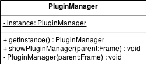
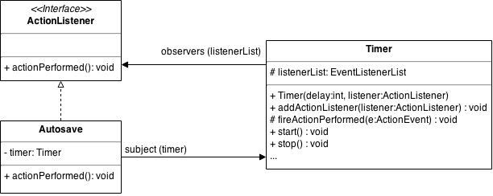
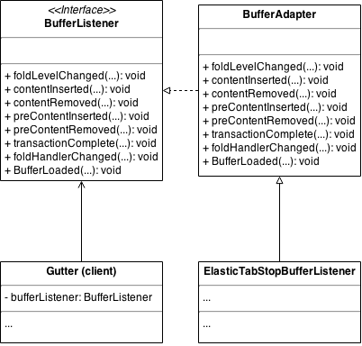

% Software Architectures - Assignement 1: Design patterns
% Abdeslam Bakkali Taheri; Vincent Lindivat

# Exercise 1: Find instances of Design Patterns

In this exercise, we had to find instances of design patterns in Jedit's code, Jedit being an open source text editor written in Java.

<!-- TODO say and justify the category (creational, structural, behavioral) -->
<!-- TODO describe the participants (class & method names) -->
<!-- TODO class diagram (only include the necessary elements)-->
<!-- TODO motivation & application of the pattern in this context (don't give a general description of the pattern) -->
<!-- TODO in what way these implementations differ from the original pattern -->

## Singleton
<!-- Related links :
    * http://www.oodesign.com/singleton-pattern.html
    * https://en.wikipedia.org/wiki/Singleton_pattern
    * https://stackoverflow.com/questions/137975/what-is-so-bad-about-singletons
    * http://tech.puredanger.com/2007/07/03/pattern-hate-singleton/
    * http://programminglarge.com/singleton-design-pattern-vs-global-variable/
    * http://gameprogrammingpatterns.com/singleton.html
    * https://programmers.stackexchange.com/questions/148108/why-is-global-state-so-evil
    * On dependency injection :
        * http://www.theserverside.com/news/1321158/A-beginners-guide-to-Dependency-Injection
        * http://www.drdobbs.com/tools/dependency-injection-testable-objects/185300375
        * http://tutorials.jenkov.com/dependency-injection/index.html
        * http://www.tonymarston.net/php-mysql/dependency-injection-is-evil.html
        * https://stackoverflow.com/questions/2407540/what-are-the-downsides-to-using-dependency-injection
        * http://www.warski.org/blog/2010/10/dependency-injection-discourages-object-oriented-programming/
-->

The singleton pattern is categorized as a creational pattern because it ensures that a specific class is **instantiated** only once.

It is often criticized because an instance of a class using this pattern can be used like a global variable. A global variable causes problem for unit testing, because it can be modified by everyone and causes unpredictability in the state of the system. It also introduces coupling with classes using it, which renders them hardly reusable. <!-- TODO ref -->

While using global variables may be seen as bad practice, and while there are alternatives (e.g. dependency injection), these alternatives may bring drawbacks such as having the code difficult to read, or the intent of the developpers may not be easy to grasp at first glance. Global variables may even be the simplest way of using tools such as a Logging class which is not directly part of the application but only here to help debugging. <!-- TODO ref -->

<!-- The gist of it is that design patterns should be used with parcimony, and should not be treated like some unquestionable magical spell. They are recipes, and can be adapted and modified to fit more specific problems that a developer encounters. Also, each decision has associated drawbacks, there is no such thing as perfect design. -->

The example we chose for a singleton implementation is the *PluginManager* class which is located in the *org.gjt.sp.jedit.pluginmgr* package. This class handles the window (extends *JFrame*) where plugins are installed and updated. The singleton pattern is used in this case so that only one plugin manager window can be instantiated and displayed at once when invoking it via the menu (*Plugins -> Plugin Manager...*). The following methods are involved :

* the *showPluginManager()* method instantiate a PluginManager if it has not already been instantiated, else it brings the plugin manager window to the front;
* The *getInstance()* method retrieve the current instance of PluginManager (can be null if it has not yet been instantiated or if the instance has been disposed of with the *dispose()* method).

\

The following classes are also implementing a singleton pattern, but we won't describe them in details.

* *ServicesManager*'s *Descriptor* inner class (*org.gjt.sp.jedit*)
* *ReflectManager* (*org.gjt.sp.jedit.bsh*)
* *KillRing* (*org.gjt.sp.jedit.buffer*)
* *ModeProvider* (*org.gjt.sp.jedit.syntax*)
* *TransferHandler* (*org.gjt.sp.jedit.datatransfer*)
* *DockableWindowFactory* (*org.gjt.sp.jedit.gui*)

## Abstract Factory
* Creational
* ServiceManager
    * "Provide an interface for creating families of related or dependent objects without specifying their concrete classes." -> here we create related objects which are the services
* deviation from original pattern: no abstract class from which the ServiceManager inherits
<!-- TODO see in more details how ServiceManager works -->
<!-- TODO see all the factories in gui/statusbar -->

## Observer
The Observer is a behavioral pattern, it is justified by the fact that subjects communicate with observers to which they are registered.

The example we chose for this pattern is composed of the *org.gjt.sp.jedit.Autosave*, *java.awt.event.ActionListener* & *javax.swing.Timer* classes. The *Autosave* class' purpose is to automatically save all buffers with unsaved changes after a certain amount of time has elapsed (default value is 30 secondes). This class implements the *ActionListener* (awt) interface which contains the *actionPerformed()* method. This method is called by a subject, here the subject being a *Timer* (swing) which calls *actionPerformed()* after the specified amount of time has elapsed. Finally, *actionPerformed()* calls the *autosave()* method on all the buffers (the buffers are globally accessible from *jEdit*'s *getBuffer()* static method).

\

The following classes are also implementing an observer pattern but were not chosen as our example.

* *RegistersListener* as the observer interface, *JEditRegistersListener* as the concrete observer, and *Registers* as the subject
* *HelpHistoryModelListener* as the observer interface, *HelpViewer* as the concrete observer and *HelpHistoryModel* as the subhect (*org.gjt.sp.jedit.help*)

## Adapter
The adapter pattern is a structural pattern used to pass an instance of a class having an interface to a client expecting another interface through a wrapper.

Here we have the *org.gjt.sp.jedit.buffer.BufferAdapter* class which implements the *org.gjt.sp.jedit.buffer.BufferListener* interface. This class contains all the *BufferListener*'s methods with empty bodies. Then, one class can inherit from *BufferAdapter* in order to avoid having to implement all *BufferListener*'s methods (e.g. *org.gjt.sp.jedit.textarea.ElasticTabStopBufferListener*, or the anonymous class in the *org.gjt.sp.jedit.textarea.Gutter* class' constructor). As stated in *BufferListener*'s documentation, this interface may change in the future. By using *BufferAdapter* instead of *BufferListener* as the expected interface, developpers will only have to modify *BufferAdapter* if *BufferListener* is modified.

<!-- TODO this implementation corresponds to the Class Adapter described on the wikipedia page but differs from the one described in the *Head First Design Patterns* book -> find more information --> 

\

Other Adapter patterns were found in jedit's code which have the same purpose as described above :

* *org.gjt.sp.jedit.bufferset.BufferSetAdapter* implementing *org.gjt.sp.jedit.bufferset.BufferSetListener*
* *org.gjt.sp.jedit.visitors.JEditVisitorAdapter* implementing *org.gjt.sp.jedit.visitors.JEditVisitor*

## Visitor
* Behavioral
<!-- possible candidates :
    * visitors folder
-->

# Exercise 2: Recognize Design Patterns
<!-- TODO -->

<!-- guesses
 * memento
 * command ?
 * composite ?
-->

# Exercise 3: Coupling & Cohesion
<!-- TODO -->
<!--
 * high cohesion and loose coopling are preferable + TODO explanations
-->

# References
<!-- TODO -->

# Miscellaneous
The following notes must not be included in the report, there are just some interesting things I noticed after searching information for this assignement.

 * A **nested class** is a member of its enclosing class. Non-static nested classes (inner classes) have access to other members of the enclosing class, even if they are declared private. Static nested classes do not have access to other members of the enclosing class. As a member of the OuterClass, a nested class can be declared private, public, protected, or package private. (Recall that outer classes can only be declared public or package private.) ([source](http://docs.oracle.com/javase/tutorial/java/javaOO/nested.html))

* Resources related to the Abstract Factory pattern :
    * <https://en.wikipedia.org/wiki/Abstract_factory_pattern>
    * <http://sourcemaking.com/design_patterns/abstract_factory>
    * <http://www.tutorialspoint.com/design_pattern/abstract_factory_pattern.htm>
    * <http://www.oodesign.com/abstract-factory-pattern.html> (!!!)
    * <http://www.dofactory.com/net/abstract-factory-design-pattern>
    * "An abstract factory has multiple factory methods, each creating a different product. The products produced by one factory are intended to be used together (your printer and cartridges better be from the same (abstract) factory). As mentioned in answers above the families of AWT GUI components, differing from platform to platform, are an example of this (although its implementation differs from the structure described in Gof)." ([source](https://stackoverflow.com/questions/1673841/examples-of-gof-design-patterns))
    * "Provide an interface for creating families of related or dependent objects without specifying their concrete classes."

* categories of design patterns
    * "Creational patterns are ones that create objects for you, rather than having you instantiate objects directly. This gives your program more flexibility in deciding which objects need to be created for a given case." (wikipedia)
    * "Structural: These concern class and object composition. They use inheritance to compose interfaces and define ways to compose objects to obtain new functionality." (wikipedia)
    * "Behavioral: Most of these design patterns are specifically concerned with communication between objects." (wikipedia)
